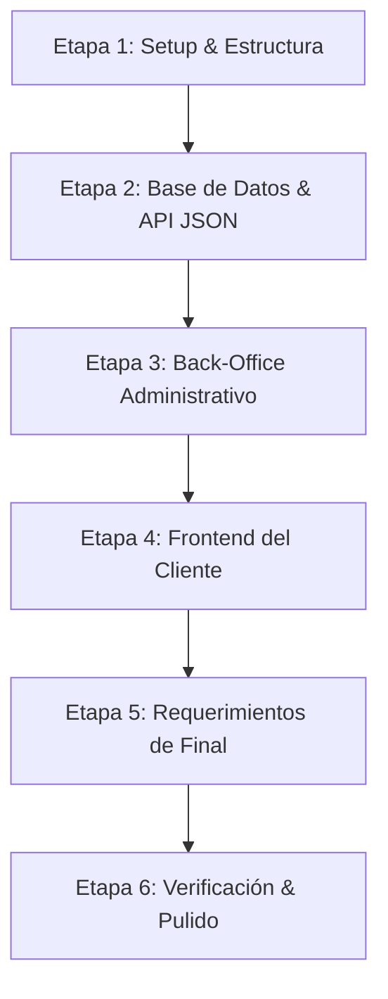

# Roadmap de Desarrollo - TP Integrador: Autoservicio (UTN)

Este documento detalla la planificación y el orden sugerido de tareas para el desarrollo integral del Trabajo Práctico Obligatorio. Está estructurado de forma incremental y contiene **todos y cada uno de los requerimientos explícitos especificados en las bases del PDF**.

---

## 📋 Resumen de Etapas de Desarrollo

---

## 🎨 Restricciones de Diseño Globales (Aplica a TODAS las vistas)
*Deben cumplirse en todo el sistema y estar siempre disponibles en las interfaces:*
- [ ] **R.1. Favicon:** El sitio web debe contar con un favicon representativo de la marca.
- [ ] **R.2. Estructura de Encabezado Obligatoria:** Todas las pantallas del frontend y backend deben mostrar visiblemente:
  1. Logo de la aplicación.
  2. Nombre de la aplicación.
  3. Nombre de los alumnos integrantes del grupo.
  4. Barra de navegación (debe adaptarse según el rol o ubicación actual).
- [ ] **R.3. Navegación Estricta por Botones:** La navegación completa por la aplicación debe ser 100% interactiva a través de botones y enlaces visibles. **El cliente/usuario final nunca debe verse obligado a tipear una ruta a mano en la barra del navegador.**
- [ ] **R.4. Diseño 100% Responsivo:** La aplicación completa debe verse y funcionar de forma premium tanto en ordenadores de escritorio como en dispositivos móviles y tablets.
- [ ] **R.5. Restricción de Rubro:** Elección libre de un rubro comercial cohesivo (productos físicos o virtuales) que **NO sea de comida**.

---

## 🛠️ Detalle de Tareas por Etapa

### Etapa 1: Arquitectura y Setup Inicial 🏗️ [Responsable: Axel]
- [ ] **1.1. Estructura del repositorio:** Configurar la raíz del proyecto delimitando la frontera de desarrollo:
  - Carpeta `backend/` (Servidor Node.js + Express, vistas EJS y API JSON).
  - Carpeta `frontend/` (SPA o archivos estáticos del autoservicio).
- [ ] **1.2. Inicialización del entorno Node.js:** 
  - Ejecutar `npm init -y` en backend.
  - Configurar `.gitignore` robusto (excluyendo `node_modules`, `.env`, archivos de bases de datos locales, y carpetas de uploads de imágenes).
  - Instalar dependencias requeridas: `express`, `ejs`, `sequelize` (o Prisma), `sqlite3` (o mysql2/pg), `dotenv`, `cors`, `multer` (para subida de archivos), y `bcrypt` (para encriptación).
- [ ] **1.3. Servidor Express base:** Configurar `app.js` configurando los middlewares para parsear JSON, URL-encoded, habilitar CORS y servir la carpeta pública de archivos estáticos.
- [ ] **1.4. Configuración del motor de vistas:** Establecer EJS (`app.set('view engine', 'ejs')`) y la ruta correspondiente para las plantillas HTML del panel de administración.

### Etapa 2: Base de Datos & API JSON (Backend) 🗄️
*El backend debe estructurarse utilizando el patrón arquitectónico Modelo-Vista-Controlador (MVC).*
- [ ] **2.1. Conexión del ORM:** [Responsable: Axel] Configurar la inicialización del ORM y definir la conexión a la base de datos usando variables de entorno (`.env`).
- [ ] **2.2. Diseño e implementación de Modelos:** [Responsable: Axel]
  - [ ] **Modelo Producto:** `id`, `nombre`, `descripcion`, `precio`, `imagenUrl`, `categoria` (dos categorías definidas), `activo` (booleano, por defecto `true`).
  - [ ] **Modelo Venta:** `id`, `nombreCliente`, `fecha` (datetime), `precioTotal`.
  - [ ] **Modelo Usuario (Administrador):** `id`, `correo` (único), `contrasena` (encriptada obligatoriamente, nunca texto plano).
  - [ ] **Modelo VentaProducto:** Tabla pivote con relación **Muchos a Muchos** entre `Producto` y `Venta` que guarde la `cantidad` unitaria y el `precio` al momento de la compra.
- [ ] **2.3. Desarrollo de Endpoints API JSON (Responde 100% JSON válido):** [Responsable: Saulo]
  - [ ] `POST /api/admin/setup` -> Creación de usuario administrador (guarda contraseña encriptada).
  - [ ] `GET /api/productos` -> Traer productos activos del sistema en formato paginado.
  - [ ] `GET /api/productos/:id` -> Detalle del producto individual.
  - [ ] `POST /api/ventas` -> Registrar una venta exitosa en base de datos. Debe procesar e insertar en las tablas correspondientes, calculando el precio total acumulado, guardando nombre de usuario, fecha y precio final.
  - [ ] `GET /api/ventas` -> Listar todas las ventas registradas junto con sus productos asociados (Eager Loading del ORM).
- [ ] **2.4. Middlewares de Validación:** [Responsable: Saulo]
  - [ ] Crear middlewares para validar que los datos recibidos en las peticiones POST y PUT sean correctos (validar formato de correo, precios positivos, tipos correctos y campos obligatorios).

### Etapa 3: Back-Office Administrativo (EJS - Backend) 🔐
*La administración utiliza un enfoque mixto: interfaz renderizada por el servidor con vistas HTML (EJS) y persistencia conectada a la base de datos.*
- [x] **3.1. Pantalla de Login (`/admin/login`):** [Responsable: Axel]
  - Formulario de ingreso que valide el correo y contraseña en la base de datos.
  - **Requisito del PDF:** Implementar un **Botón de Acceso Rápido** que autocomplete las credenciales del tester/profesor con un solo clic.
- [ ] **3.2. Dashboard de Administración (`/admin/dashboard`):** [Responsable: Saulo]
  - Acceso protegido por sesión/cookie middleware.
  - Mostrar tabla/listado con todos los productos de la base de datos, agrupados o identificados según sus dos categorías correspondientes.
  - Mostrar claramente el estado del producto (`Activo` / `Inactivo`).
- [ ] **3.3. Acciones de Administración sobre Productos:**
  - **Alta de Producto (`/admin/productos/nuevo`):** [Responsable: Axel] Formulario para cargar nombre, precio, descripción, categoría y cargar un archivo de imagen.
    - *Requisito del PDF:* Carga real de imágenes físicas guardadas en el servidor (usando `multer`). Los productos nuevos se crean activos por defecto.
  - **Modificación de Producto (`/admin/productos/editar/:id`):** [Responsable: Axel] Formulario precargado para editar todos los datos del producto y reemplazar la imagen (reutilizar la interfaz de alta).
  - **Baja Lógica / Desactivación:** [Responsable: Saulo]
    - Botón para desactivar producto. Debe lanzar un **Modal de Confirmación** que pregunte al administrador si está seguro de eliminar/desactivar.
    - Al confirmar, cambia la propiedad booleana `activo` a `false` en la BD.
    - *Regla de negocio:* Un producto desactivado ya no debe mostrarse bajo ningún concepto en la aplicación del cliente.
  - **Reactivación:** [Responsable: Saulo] Botón para activar un producto inactivo. Debe lanzar un **Modal de Confirmación** y cambiar la propiedad `activo` a `true` en la BD.
- [ ] **3.4. Reporte de Ventas en Excel:** [Responsable: Saulo]
  - Agregar un botón en el panel administrador que genere y descargue un archivo Excel (.xlsx) con el historial completo de ventas realizadas.

### Etapa 4: Frontend de Autoservicio del Cliente 📱
*Desarrollo de la aplicación para el kiosco interactivo de autoservicio. Debe consumir la API REST del backend.*
- [ ] **4.1. Maquetación base y soporte de Temas:** [Responsable: Saulo]
  - Diseñar CSS moderno con variables para **Tema Claro y Tema Oscuro**.
  - Agregar un botón/switch persistente para cambiar de tema. Al recargar la página, se debe conservar el tema guardado en `localStorage`.
- [ ] **4.2. Flujo Completo del Cliente (Paso a Paso del PDF):**
  1. **Pantalla de Bienvenida:** [Responsable: Saulo] El cliente entra al sitio. Se muestra un input para ingresar el nombre de usuario (solo nombre). No se permite continuar hasta completar este campo.
  2. **Catálogo de Productos:** [Responsable: Saulo] Redirección automática tras completar el paso 1. Se listan los productos activos paginados y separados por las dos categorías. Cada producto muestra: imagen, nombre, precio, descripción y controles de cantidad.
  3. **Gestión del Carrito:** [Responsable: Axel]
     - Capacidad de agregar productos al carrito.
     - Posibilidad de comprar varias unidades de un mismo producto (modificar cantidad desde el catálogo o desde el carrito).
     - Permitir eliminar productos por completo del carrito si no se desean comprar.
  4. **Confirmación de Compra:** [Responsable: Axel]
     - Botón de finalizar compra.
     - **Requisito del PDF:** Lanzar un **Modal de Confirmación** que pregunte si se desea confirmar la compra.
     - Al confirmar, enviar la venta a la API backend (`POST /api/ventas`).
  5. **Pantalla de Ticket:** [Responsable: Axel]
     - Mostrar los datos de los productos comprados, cantidad de unidades, precio unitario, precio total, el nombre del cliente ingresado en el inicio, la fecha actual y el nombre comercial del autoservicio.
     - **Requisito del PDF:** Proveer un botón interactivo para **Descargar el Ticket en formato PDF**.
  6. **Reinicio de Flujo:** [Responsable: Axel] Botón "Salir" que limpia completamente el estado de la compra (carrito, nombre) y redirige de vuelta a la Pantalla de Bienvenida para un nuevo cliente.

---

## 🎓 Requerimientos Extra para Instancia de Examen Final

### 1. Adicionales del Cliente / Usuario [Responsable: Axel]
- [ ] **E.1. Redirección a Encuesta Obligatoria:** Al finalizar la compra, luego de visualizar el ticket y presionar el botón "Salir", el sistema debe redirigir obligatoriamente a una **Pantalla de Encuesta**.
- [ ] **E.2. Formulario de Encuesta Multiuso:** Debe recolectar la opinión del consumidor utilizando obligatoriamente al menos **5 tipos de input distintos**:
  1. `textarea`: Opinión de texto libre del cliente.
  2. `email`: Correo electrónico del cliente.
  3. `checkbox`: Pregunta booleana (ej. "¿Recomendaría el servicio?").
  4. `slider` (`range`): Puntuación otorgada al servicio (ej. de 1 a 10).
  5. `file`: Subida de archivo de imagen (ej. foto del local o del ticket físico) para almacenar en el servidor.
- [ ] **E.3. Validación y Modales de Encuesta:**
  - Validar todos los datos recibidos con mensajes claros de error.
  - Ofrecer la opción de "Omitir" la encuesta con un botón visible pero no destacado visualmente.
  - Al completar correctamente, mostrar un **Modal de Agradecimiento** y persistir las respuestas en la base de datos junto con la fecha actual.
- [ ] **E.4. Pantalla de Detalle de Producto:** Crear una ruta accesible en el frontend para ver el detalle en profundidad de un producto específico, tomando su ID desde la barra de direcciones (ej: `/productos/:id`).

### 2. Adicionales de la Administración [Responsable: Saulo]
- [ ] **E.5. Pantalla de Registros y Auditoría:** Nueva sección exclusiva dentro del Back-Office de administrador.
- [ ] **E.6. Sistema de Logs:** El backend debe registrar automáticamente un Log (fecha, hora, usuario de admin) cada vez que un administrador inicia sesión exitosamente.
- [ ] **E.7. Panel de Monitoreo visual de Logs:** Permitir leer e inspeccionar dicho historial de Logs desde la Pantalla de Registros.
- [ ] **E.8. Panel Estadístico de Rendimiento:** Mostrar de manera clara mediante tablas y listados ordenados:
  - Top 10 de productos más vendidos en el sistema.
  - Top 10 de ventas más caras registradas históricamente.
  - Al menos otras dos estadísticas del negocio derivadas del historial de ventas, productos o logs.
- [ ] **E.9. Descarga de Encuestas:** Incorporar botón para descargar en Excel (.xlsx) todo el listado de respuestas de encuestas de clientes.
